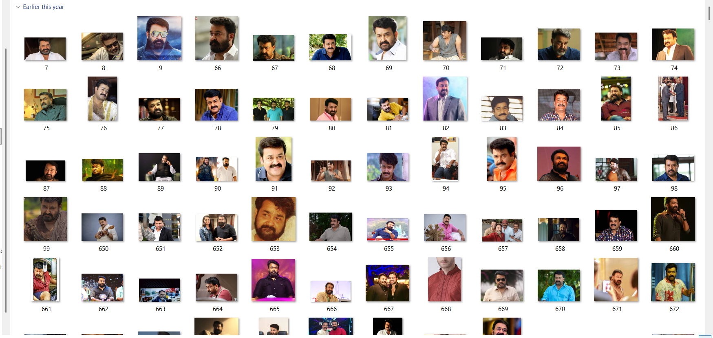
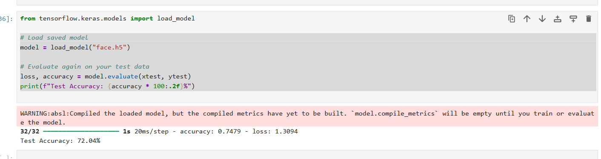

# 🎭 Actor Image Classifier (Mammootty vs Mohanlal)

This project is a **Convolutional Neural Network (CNN)** built with **TensorFlow/Keras** that classifies images of the two legendary Malayalam actors — **Mammootty** and **Mohanlal**.  

The model was trained on the **[Mohanlal & Mammootty Images Kaggle Dataset](https://www.kaggle.com/datasets/fillerink/mohanlal-mammooty-images)** for **100 epochs**, achieving strong accuracy in distinguishing between the two actors.  

---

## 📂 Dataset
- Source: [Kaggle Dataset](https://www.kaggle.com/datasets/fillerink/mohanlal-mammooty-images)  
- Classes:  
  - `mammootty/`  
  - `mohanlal/`  

### Dataset Samples
Mammootty:  
  

Mohanlal:  
  

---

## 🧠 Model
- Framework: TensorFlow / Keras  
- Architecture: Convolutional Neural Network  
- Training: 100 epochs  
- Optimizer: Adam  
- Loss: Categorical Crossentropy  

---

## 🚀 Features
✔️ Classifies between Mammootty & Mohanlal  
✔️ Works on images and webcam live feed  
✔️ Built with TensorFlow + OpenCV  

---

## 📸 Results  

### 🔹 Live Face Recognition
Model tested with webcam input:  

  
  

### 🔹 Training Performance
Training accuracy & loss over 100 epochs:  
  

---

## ⚙️ Installation & Usage
```bash
# Clone repository
git clone https://github.com/your-username/Image_Classifier.git
cd Image_Classifier

# Install dependencies
pip install -r requirements.txt

# Run Jupyter Notebook
jupyter notebook actors.ipynb
```

For **live recognition**:
```bash
python live_face_recognition.py
```

---

## 📊 Training Logs
- Epochs: 100  
- Test Accuracy: **72.04%**  
- Test Loss: **1.3094**  

---

## 📌 Future Improvements
- Deploy as a web app (Flask/Streamlit)  
- Add more actors for multi-class classification  
- Try transfer learning (e.g., VGG16, ResNet)  

---

## 📝 License
MIT License.  
